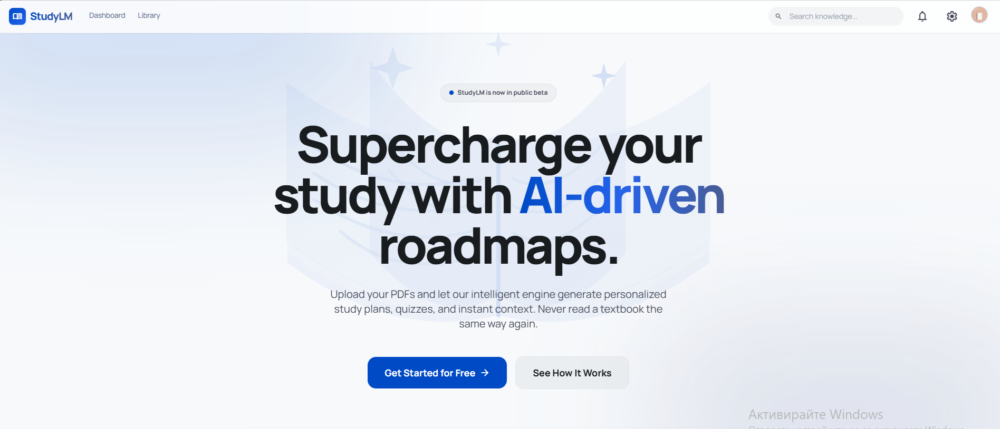
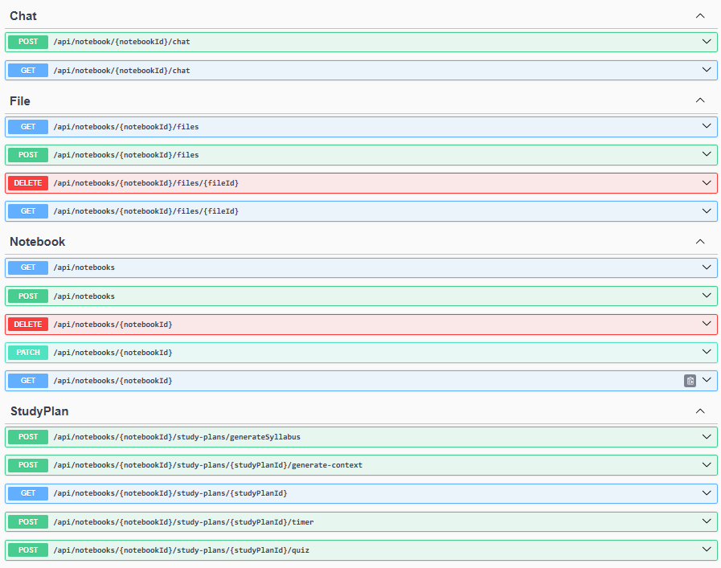

# StudyLM 🎓

StudyLM is an intelligent, AI-driven study platform designed to supercharge the way students and lifelong learners consume and interact with their educational materials. 

Simply upload your PDFs, lecture notes, or textbooks, and StudyLM's advanced engine will automatically generate structured, personalized learning modules so you never have to read a textbook the same way again.

<div align="center">
  
</div>

## ✨ Key Features

*   **Automated Study Plans:** Our AI engine scans your uploaded materials and breaks them down into a logical, step-by-step syllabus sorted by complexity.
*   **RAG-Powered Document Chat:** Chat directly with your documents. Ask complex questions and get instant, cited answers based strictly on the content you uploaded.
*   **Smart Quizzes:** Test your knowledge at the end of each generated module with dynamic quizzes to ensure long-term retention.
*   **Progress Tracking:** Watch your knowledge grow with visual indicators tracking the exact time spent per module and your overall completion rate.
*   **Beautiful, Modern UI:** Built with an emphasis on a glassmorphic, responsive, and highly animated user experience.

---

## 🏗️ Architecture & Tech Stack

The application is built using a modern, multi-language microservice architecture designed for scalability and performance:

*   **Frontend Client:** React (Vite), TypeScript, Tailwind CSS, React Router
*   **Core Backend API:** ASP.NET Core Entity Framework handling secure authentication, database operations, and application business logic.
*   **AI Processing Service:** Python (FastAPI/Flask) handling heavy lifting such as PDF parsing, and the RAG (Retrieval-Augmented Generation) pipeline.

<div align="center">
  
</div>

---

## 🚀 Getting Started

### The Easy Way (Docker) 🐳

The fastest way to get StudyLM running locally is using Docker Compose. This will automatically spin up the database, both backends, and the frontend.

1. Clone the repository and navigate to the project root.
2. Ensure you have Docker and Docker Compose installed.
3. Configure the environment variables (see **Configuration** section below).
4. Run the stack:
   ```bash
   docker compose up --build
   ```
5. The application will be available at `http://localhost:3000`.

---

### Configuration & API Keys 🔑

Before running the application (either manually or via Docker), you must configure the internal communication keys and your Gemini API key.

1. **.NET Backend (`backend-dotnet/appsettings.json`)**
   Update your `appsettings.json` to include the shared internal API key and your Gemini key:
   ```json
   "ExternalServices": {
     "Python": {
       "ServiceUrl": "http://localhost:5001",
       "ApiKey": "my_super_secret_internal_key_123"
     },
     "Gemini": {
       "ApiKey": "YOUR_GEMINI_API_KEY",
       "Model": "gemini-2.5-flash-lite"
     }
   }
   ```
   *(Note: If using Docker, `ServiceUrl` should be `http://backend-python:8000`)*

2. **Python AI Service (`backend-python/.env`)**
   Create a `.env` file in the `backend-python` directory to match the internal key:
   ```env
   API_KEY=my_super_secret_internal_key_123
   ```

3. **Database Credentials (Docker Only)**
   If using Docker, create a `.env` file in the **root** directory:
   ```env
   POSTGRES_USER=your_user
   POSTGRES_PASSWORD=your_password
   POSTGRES_DB=studylm_db
   ```

---

### Local Development (Manual Setup) 🛠️

If you want to run the services separately for active development and debugging:

#### Prerequisites
* Node.js (v18+)
* .NET SDK (v8.0+)
* Python (v3.10+)
* PostgreSQL (with pgvector extension)

1. **Frontend**
   ```bash
   cd frontend
   npm install
   npm run dev
   ```

2. **.NET Backend**
   ```bash
   cd backend-dotnet
   dotnet restore
   dotnet run
   ```

3. **Python AI Service**
   ```bash
   cd backend-python
   pip install -r requirements.txt
   python main.py
   ```
