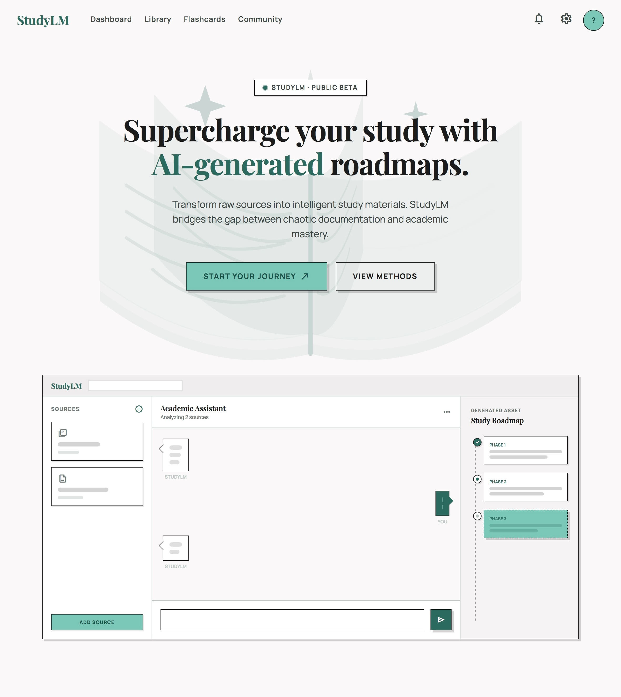
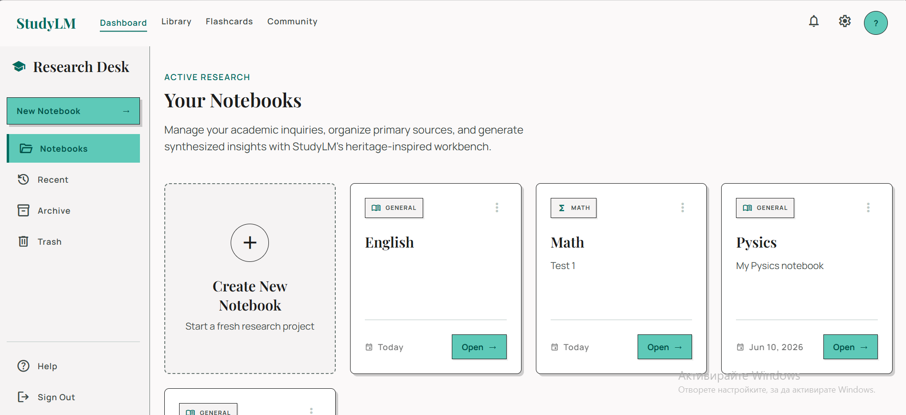
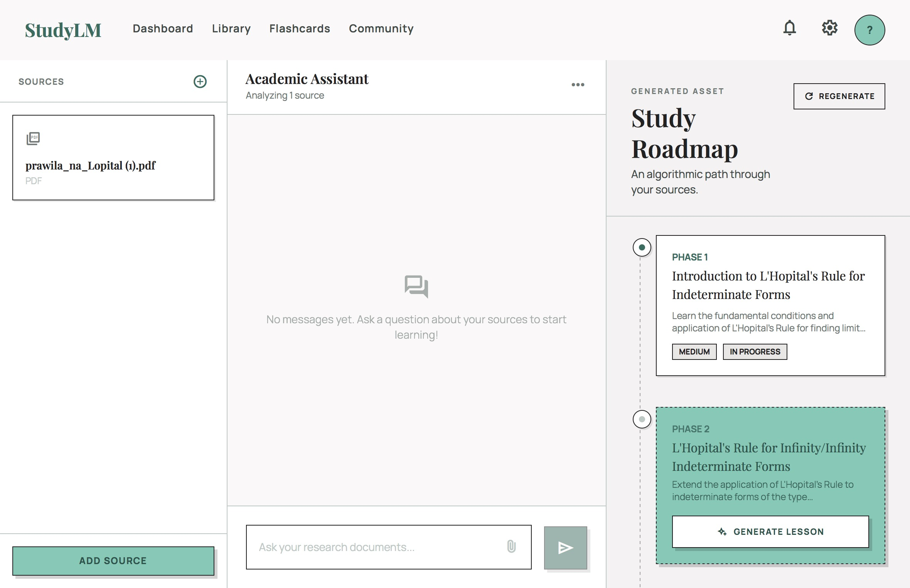
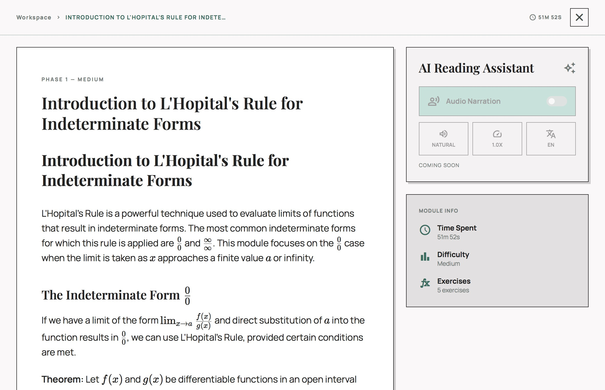
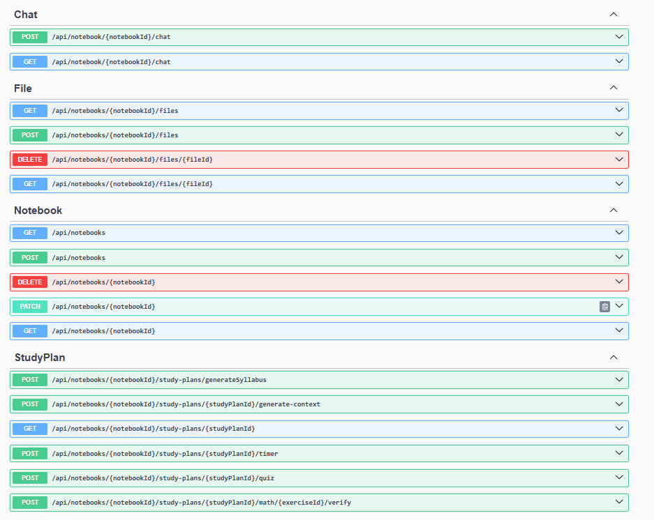
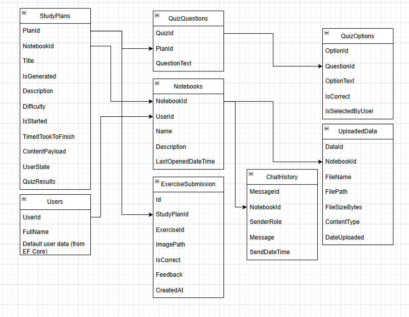

# StudyLM 🎓

StudyLM is an intelligent, AI-driven study platform designed to supercharge the way students and lifelong learners consume and interact with their educational materials.

Simply upload your PDFs, lecture notes, or textbooks, and StudyLM's advanced engine will automatically generate structured, personalized learning modules so you never have to read a textbook the same way again.

<div align="center">
  
</div>

## ✨ Key Features

*   **Automated Study Plans:** Our AI engine scans your uploaded materials and breaks them down into a logical, step-by-step syllabus sorted by complexity.
*   **RAG-Powered Document Chat:** Chat directly with your documents. Ask complex questions and get instant, grounded answers based strictly on the content you uploaded.
*   **Math Notebooks:** A dedicated notebook type renders LaTeX/mathematical notation beautifully via KaTeX, so formula-heavy material reads the way it should.
*   **Smart Quizzes:** Test your knowledge at the end of each generated module with dynamic quizzes to ensure long-term retention.
*   **Progress Tracking:** Watch your knowledge grow with visual indicators tracking the exact time spent per module and your overall completion rate.
*   **Hand-Drawn Academic UI:** A distinctive, responsive design built around a warm parchment palette, etched borders, and hard offset shadows — no two screens feel like a generic dashboard.

<div align="center">
  
</div>

<div align="center">
  
</div>

<div align="center">
  
</div>

---

## 🏗️ Architecture & Tech Stack

The application is built using a modern, multi-language microservice architecture designed for scalability and performance:

*   **Frontend Client:** React 18 + TypeScript (Vite), Tailwind CSS v3, React Router. Chat and lesson content render Markdown via `react-markdown`, with `remark-math` + `rehype-katex` for LaTeX.
*   **Core Backend API:** ASP.NET Core 8 with Entity Framework Core, handling secure cookie-based authentication, database operations, and application business logic.
*   **AI Processing Service:** Python (FastAPI) handling the heavy lifting such as PDF parsing and the RAG (Retrieval-Augmented Generation) pipeline.
*   **Database:** PostgreSQL with the `pgvector` extension for storing document embeddings and powering similarity search.
*   **LLM:** Google Gemini for syllabus generation, lesson content, and chat responses.

<div align="center">
  
</div>

<div align="center">
  
</div>

---

## 🚀 Getting Started

### The Easy Way (Docker) 🐳

The fastest way to get StudyLM running locally is using Docker Compose. This will automatically spin up the database, both backends, and the frontend.

1. Clone the repository and navigate to the project root.
2. Ensure you have Docker and Docker Compose installed.
3. Create your environment file (see **Configuration** section below).
4. Run the stack:
   ```bash
   docker compose up --build
   ```
5. The application will be available at `http://localhost:3000`.

---

### Configuration & API Keys 🔑

When running with Docker, **all** credentials and API keys are read from a single `.env` file in the **root** directory. Copy the provided template and fill in your values:

```bash
cp .env.example .env
```

```env
POSTGRES_USER=your_db_user
POSTGRES_PASSWORD=your_db_password
POSTGRES_DB=your_db_name

PYTHON_API_KEY=any_shared_internal_key   # shared internal key between the .NET and Python services
GEMINI_API_KEY=your_gemini_api_key       # your Google Gemini API key
```

`docker-compose.yml` injects these into the .NET backend, the Python service, and the database automatically — no per-service config is needed for the Docker workflow.

> **Manual setup only:** if you run the .NET backend outside Docker, configure it via `backend-dotnet/appsettings.json`:
>
> ```json
> "ExternalServices": {
>   "Python": {
>     "ServiceUrl": "http://localhost:5001",
>     "ApiKey": "any_shared_internal_key"
>   },
>   "Gemini": {
>     "ApiKey": "YOUR_GEMINI_API_KEY",
>     "Model": "gemini-2.5-flash-lite"
>   }
> }
> ```

---

### Local Development (Manual Setup) 🛠️

If you want to run the services separately for active development and debugging:

#### Prerequisites
* Node.js (v18+)
* .NET SDK (v8.0+)
* Python (v3.10+)
* PostgreSQL (with the `pgvector` extension)

1. **Frontend**
   ```bash
   cd frontend
   npm install
   npm run dev
   ```

2. **.NET Backend**
   ```bash
   cd backend-dotnet
   dotnet restore
   dotnet run
   ```

3. **Python AI Service**
   ```bash
   cd backend-python
   pip install -r requirements.txt
   python main.py
   ```
