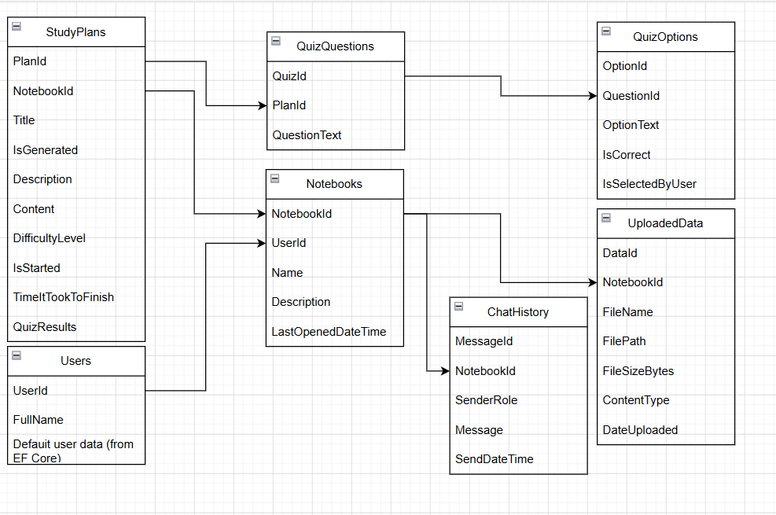

# StudyLM .NET Backend 🚀

This is the core API for StudyLM, built with ASP.NET Core (.NET 8/9). It handles authentication, data management, and orchestrates the AI study workflows.

## 🛠️ Tech Stack
- **Framework:** ASP.NET Core 8.0/9.0
- **Database:** PostgreSQL with pgvector
- **ORM:** Entity Framework Core
- **AI Integration:** Google Gemini API
- **File Processing:** Integration with Python microservice

## 📂 API Reference

All endpoints (except auth) require an `Authorization` header with a valid session/token.

### 📓 Notebooks (`/api/notebooks`)
Manage your study notebooks.

- **GET `/api/notebooks`**
  - Fetches all notebooks for the current user.
- **POST `/api/notebooks`**
  - Creates a new notebook.
  - Body: `{ "title": "string", "description": "string" }`
- **GET `/api/notebooks/{id}`**
  - Fetches detailed info about a notebook, including its files, study plans, and recent chat history.
- **PATCH `/api/notebooks/{id}`**
  - Updates notebook metadata.
  - Body: `{ "title": "string", "description": "string" }`
- **DELETE `/api/notebooks/{id}`**
  - Deletes a notebook and all associated data.

### 📄 Files (`/api/notebooks/{notebookId}/files`)
Handle document uploads and management.

- **GET `/`**
  - Lists all files in the notebook.
- **POST `/`**
  - Uploads a new file (PDF, Doc, etc.).
  - Body: `multipart/form-data` with `file`.
- **GET `/{fileId}`**
  - Downloads or previews a specific file.
- **DELETE `/{fileId}`**
  - Removes a file from the notebook.

### 🗺️ Study Plans (`/api/notebooks/{notebookId}/study-plans`)
The AI-driven learning engine.

- **POST `/generateSyllabus`**
  - Analyzes notebook content and generates a new syllabus.
- **POST `/{id}/generate-context`**
  - Deep-dives into a specific module to generate rich learning content.
- **GET `/{id}`**
  - Fetches the full content of a study plan module, including its quiz.
- **POST `/{id}/timer`**
  - Updates the study time spent on a module.
  - Query: `?secondsSpent=int`
- **POST `/{id}/quiz`**
  - Submits quiz answers and returns the score.
  - Body: `{ "answers": { "questionId": "optionId" } }`

### 💬 Chat (`/api/notebook/{notebookId}/chat`)
Context-aware AI assistance.

- **POST `/`**
  - Sends a message to the RAG-powered chatbot.
  - Body: `{ "message": "string" }`
- **GET `/`**
  - Fetches chat history.
  - Query: `?lastMessageId=int`

## Database Schema

  

## ⚙️ Configuration
Configure your `appsettings.json`:
- `ConnectionStrings:DefaultConnection`: PostgreSQL connection string.
- `ExternalServices:Python:ServiceUrl`: URL of the Python AI microservice.
- `ExternalServices:Python:ApiKey`: Shared secret for internal communication.
- `ExternalServices:Gemini:ApiKey`: Your Google Gemini API key.
