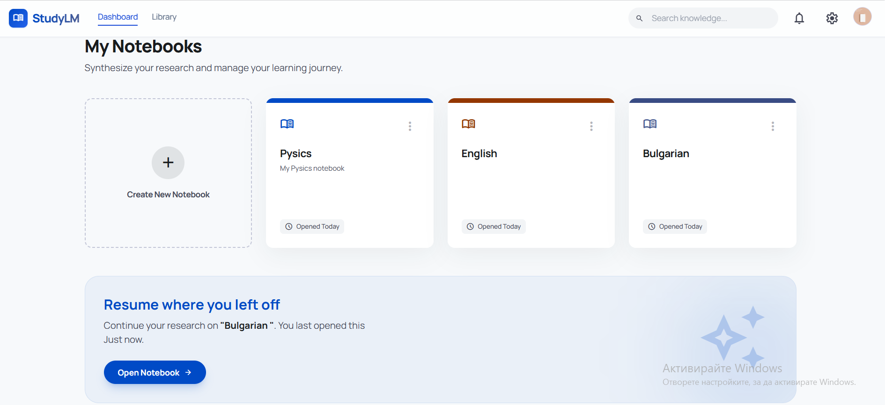
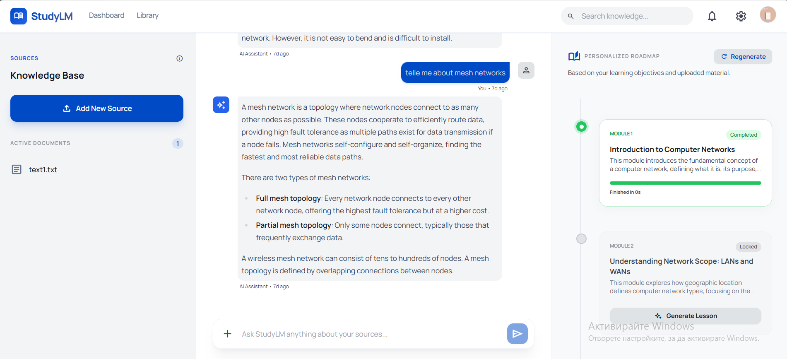
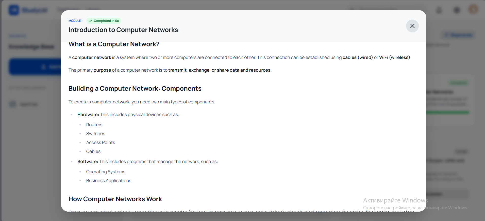

# StudyLM Frontend 🎨

The user interface for StudyLM, built with React and TypeScript. It features a modern, responsive design with glassmorphic elements and high-fidelity 3D animations.

## ✨ Features

- **Premium Landing Page:** A high-converting entry point with 3D-animated background elements and interactive feature grids.
- **Dynamic Dashboard:** Manage your study notebooks with a clean, organized bento-style grid.
- **Integrated Workspace:** A three-column workspace for document management, RAG-powered AI chat, and structured study plans.
- **Modern Auth Flow:** Secure and beautiful login and registration interfaces.
- **Responsive Design:** Fully optimized for all screen sizes, from mobile to ultra-wide monitors.

## 🖼️ Gallery

<div align="center">
  <h3>Hero Experience</h3>
  
  
  <h3>User Dashboard</h3>
  
  
  <h3>Notebook Management</h3>
  
  
  <h3>Study Workspace</h3>
  
</div>

## 🛠️ Tech Stack

- **Framework:** React 19 (Vite)
- **Language:** TypeScript
- **Styling:** Tailwind CSS (with custom glassmorphism utilities)
- **Icons:** Material Symbols (Outlined)
- **Routing:** React Router v7
- **HTTP Client:** Axios (with centralized interceptors)
- **Animations:** Custom CSS 3D Keyframes & Tailwind Transitions

## 🚀 Getting Started

### Prerequisites
- Node.js (v18+)
- npm (v9+)

### Installation

1. Navigate to the frontend directory:
   ```bash
   cd frontend
   ```

2. Install dependencies:
   ```bash
   npm install
   ```

3. Configure the API URL:
   Ensure `src/services/api.ts` points to your backend:
   ```typescript
   export const API_BASE_URL = 'http://localhost:5000/api';
   ```

4. Start the development server:
   ```bash
   npm run dev
   ```

The app will be available at `http://localhost:3000`.

## 📂 Project Structure

- `src/components/`: Reusable UI components (Layout, Dashboard, Workspace).
- `src/pages/`: Main page views (Landing, Dashboard, Workspace, Auth).
- `src/context/`: State management (AuthContext).
- `src/services/`: API client and service definitions.
- `src/utils/`: Helper functions and parsers.
- `src/index.css`: Global styles and custom animation keyframes.
